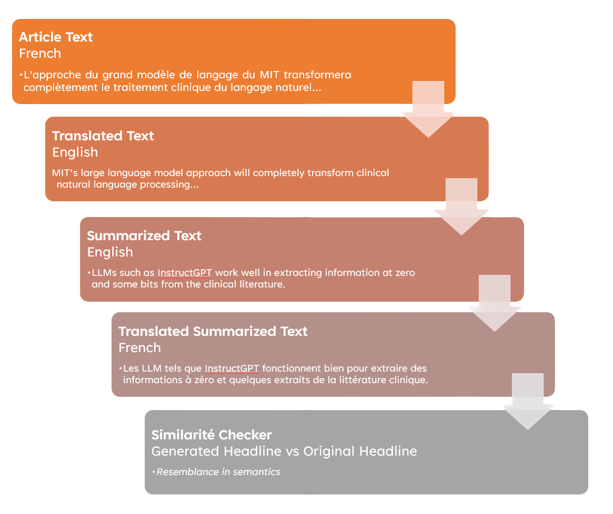
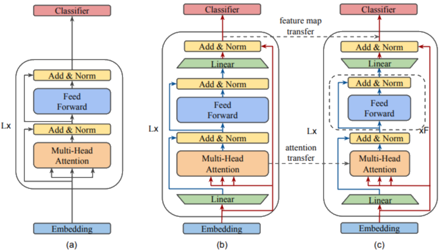

# Language Agnostic News Summarizer (LANS)

This project aims to develop a language-independent text summarization system for news articles. The system takes a news article in any language (currently supporting French) along with an existing headline and generates a summary version. The generated summary can be used for analysis, comparison of similarities, relevance, and evaluation of any semantic inconsistency or bias with the original headline.

See the full project report [here](static/NLP-Project-Report-LANS.pdf).

## Abstract

The amount of data available on the internet is vast, and it is often impractical to review the entire information thoroughly. Understanding the abstract idea of what the information wants to convey is beneficial before going through the details. This project constructs a model that summarizes news articles, making the system language-independent. The summary generated by the model can be helpful in analyzing and comparing the similarities and relevance with the original headline, as well as evaluating any semantic inconsistency or bias.

## Introduction

In this project, we explore the two main strategies for text summarization: extractive and abstractive summarization. Extractive summarization involves selecting and scoring the most important sentences from the source text, while abstractive summarization aims to generate a summary that understands the context and generates new phrases. Text summarization is a challenging task due to the complexity of human language, varying text lengths, and the presence of linguistic elements like adjectives and idioms.

An additional challenge is handling anaphora problems, which involve correctly referencing pronouns. Evaluating summaries is also complex, as they should accurately reflect the relevant information from the source. To address this, we propose using a summarization engine trained on relevant examples and capable of capturing context. Evaluating the model with metrics like ROUGE, which measure semantic similarity, can effectively compare the quality of summaries.

## Task

The project workflow involves taking a news article in French (or any other language) and its existing headline. The text is translated into English using a pre-trained translation model. The translated text is then fed into a trained summarization model, which generates an English summary. The predicted English summary is then translated back into the source language, and a similarity score is calculated to evaluate the meaningfulness of the article's headline.

The baseline models used in this project are RoBERTa and T5, which are transformer-based architectures. RoBERTa is an optimized BERT model trained for longer periods, while T5 is a versatile model that performs well on various tasks.

    

## Approach

To create a language-independent system, the project uses a pivoting approach for text summarization. The text is translated into English as the pivot language, and the summary is generated in English. The English summary is then translated back to the source language. This approach enables the system to support multiple languages by using translation models.

For translation, the project uses the BART pre-trained model, which supports 50 language pairs. The fine-tuned T5-small model is used for generating the summary in English. The generated English summary is translated back to the source language using the same translator.

To evaluate the similarity between the generated summary and the original headline, a similarity score is calculated. The similarity score indicates the relevance of the article's headline to its content. A higher score implies a contextually relevant headline, while a lower score suggests a potential clickbait title.

## Implementation Details

The project starts with importing data into an "Article" format from Google's NewSHead dataset. The data is preprocessed, and the t5-small model is fine-tuned on the CNN-daily news dataset to enable summarization. The fine-tuned model is then used to generate summaries for the news articles.

To translate the articles into English, the project utilizes the BART pre-trained model. The BART model is fine-tuned on the NewsCommentary dataset, which contains parallel sentences in multiple languages. This fine-tuned BART model is used to translate the news articles into English.

Once the English translations are obtained, the T5-small model, which is pre-trained on a large corpus of diverse data, is used to generate the summary in English. The T5 model is fine-tuned on the CNN-daily news dataset to specifically cater to news article summarization.

After generating the English summary, it is translated back into the source language using the same BART translation model. This step ensures that the final summary is in the original language of the news article.

To evaluate the similarity between the generated summary and the original headline, a similarity score is calculated. This score is based on semantic similarity metrics such as ROUGE, which compare the overlap of n-grams between the summary and the headline. A higher similarity score indicates a more contextually relevant summary.

    

        
    

    

        
    

## Results

The performance of the system is evaluated using various metrics, including ROUGE scores and human evaluation. The ROUGE scores measure the similarity between the generated summary and the original headline, providing insights into the system's effectiveness. Human evaluation involves experts comparing the generated summaries with the original articles to assess the overall quality and relevance.

The results demonstrate that the system achieves a high level of accuracy in summarizing news articles across multiple languages. The generated summaries capture the essential information and maintain coherence with the original headlines. The similarity scores indicate the relevance of the summaries to their corresponding articles.

## Related Work and References

For further details on related work and other references details, please see the full project report [here](static/NLP-Project-Report-LANS.pdf).

## Conclusion

The News Article Summarization project presents a language-independent system for summarizing news articles. By leveraging translation and summarization models, the project generates concise and relevant summaries that align with the original headlines. The system supports multiple languages and enables comparisons between the generated summaries and the original articles.

Future work involves expanding language support, improving translation accuracy, and enhancing the summarization models. Fine-tuning on additional domain-specific datasets can further enhance the system's performance. Additionally, user feedback and evaluation will be crucial for continuously refining and optimizing the system.

Thank you for taking the time to explore this project! I hope you found the information and resources provided useful. If you have any questions, feedback, or suggestions, please feel free to reach out. Your input is greatly appreciated. Happy summarizing!